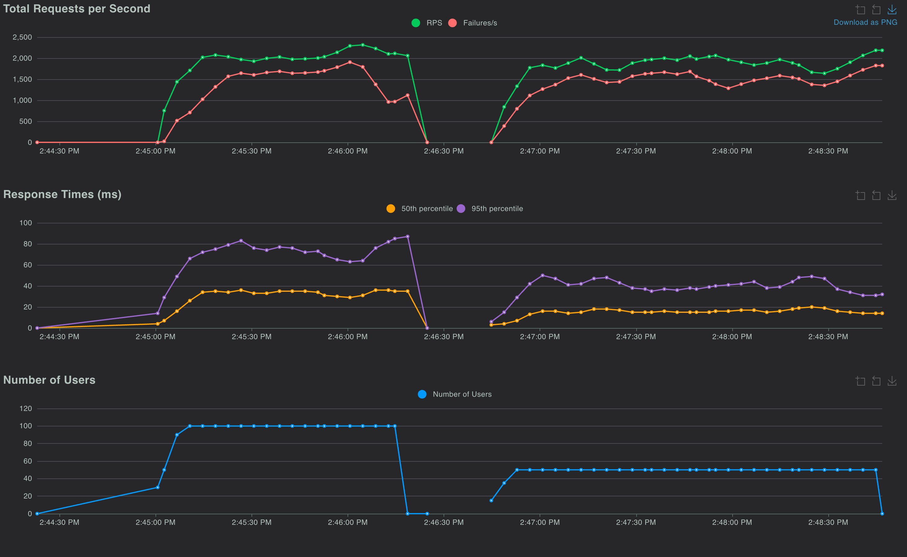

# Distributed Rate Limiting Service

A horizontally scalable API rate limiter built with FastAPI and Redis, implementing a sliding window algorithm to enforce request quotas across multiple service instances.

## Performance Metrics
Tested with Locust under realistic load conditions:

- **Throughput**: 2,000+ requests/second
- **Latency (P50)**: ~15-20ms
- **Latency (P95)**: ~40-50ms
- **Latency (P99)**: <60ms
- **Concurrent Users**: 100+
- **Rate Limit Accuracy**: >99%

### Load Test Results



*Load testing with 50-100 concurrent users showing consistent throughput and low latency*

## 🏗️ Architecture
```
┌─────────────┐
│   Nginx     │  Load Balancer (Port 80)
│ (Round Robin)│
└──────┬──────┘
       │
       ├──────────┬──────────┬──────────┐
       │          │          │          │
   ┌───▼───┐  ┌──▼────┐  ┌──▼────┐    │
   │ API 1 │  │ API 2 │  │ API 3 │    │
   │:8001  │  │:8002  │  │:8003  │    │
   └───┬───┘  └───┬───┘  └───┬───┘    │
       │          │          │         │
       └──────────┴──────────┴─────────┘
                  │
            ┌─────▼─────┐
            │   Redis   │  Shared State
            │   :6379   │
            └───────────┘
```

## Tech Stack

- **Backend**: FastAPI (Python)
- **Database**: Redis (in-memory key-value store)
- **Load Balancer**: Nginx
- **Containerization**: Docker, Docker Compose
- **Load Testing**: Locust

## Features

- **Sliding Window Algorithm**: Accurate rate limiting using Redis sorted sets
- **Distributed Architecture**: Shared state across multiple API instances
- **Horizontal Scalability**: Add more API servers without code changes
- **Fault Tolerance**: Continues working if individual API servers fail
- **Per-User Limits**: Independent rate limits for each user
- **Real-time Stats**: Query current usage and remaining quota

## Installation

### Prerequisites
- Docker and Docker Compose
- Python 3.11+

### Setup

1. Clone the repository:
```bash
git clone <your-repo-url>
cd distributed-rate-limiter
```

2. Start all services:
```bash
docker compose up --build
```

This starts:
- 3 FastAPI servers (ports 8001, 8002, 8003)
- Redis (port 6379)
- Nginx load balancer (port 80)

## Testing

### Manual Testing
```bash
# Test through load balancer
curl "http://localhost/api/data?user_id=test_user"

# Check user stats
curl "http://localhost:8001/stats/test_user"

# Health check
curl "http://localhost/health"
```

### Load Testing
```bash
# Install Locust
pip install locust

# Run load test
locust -f loadtest/
